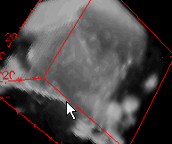
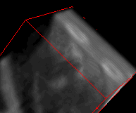
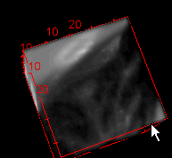

# 天池医疗AI大赛：肺部结节智能诊断[第二赛季]

## 背景
### 肺部原始图，肺部腐蚀图，肺部气管图
  

### 肺部2D图，肺部3D图，肺部阈值图
  

## 任务
### 真肿瘤
  

### 假肿瘤
  

### 絮状肿瘤，小肿瘤，肺壁肿瘤
  

## Run
```
python ./prepare/main.py

python ./1_train/main.py
python ./1_train/check.py

python ./1_test/main.py
python ./1_test/check.py

python ./1_test/save_csv.py

python ./2_train/create_data.py
python ./2_train/check.py
```

Created by lining@2017/9/30
