# Tianchi

## 背景
### 肺部原始图，肺部腐蚀图，肺部气管图
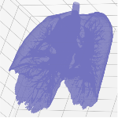 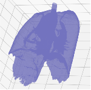 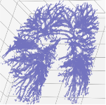

### 肺部2D图，肺部3D图，肺部阈值图
 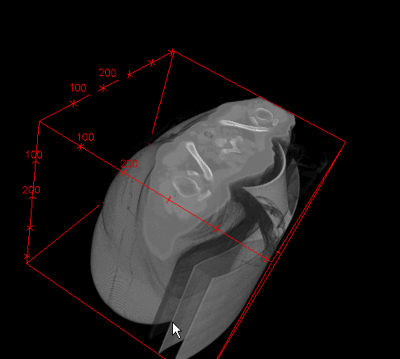 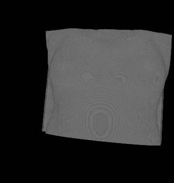

### 真肿瘤
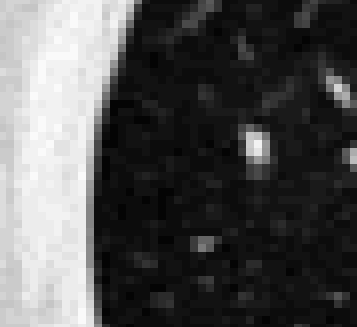 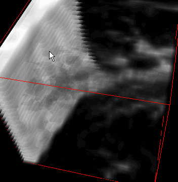 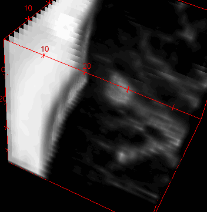

### 假肿瘤
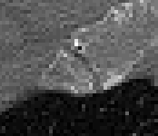 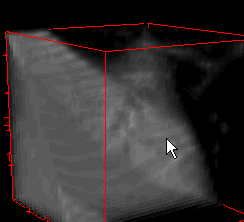 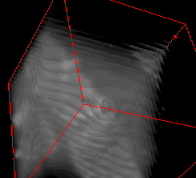

## Run
### Step 1
`python ./prepare/main.py`

### Step 2
```
python ./1_train/main.py
python ./1_train/check.py
```

### Step 3
```
python ./1_test/main.py
python ./1_test/check.py
```
### Step 4
`python ./1_test/save_csv.py`

### Step 5
```
python ./2_train/create_data.py
python ./2_train/check.py
```

Created by lining@2017/9/30
